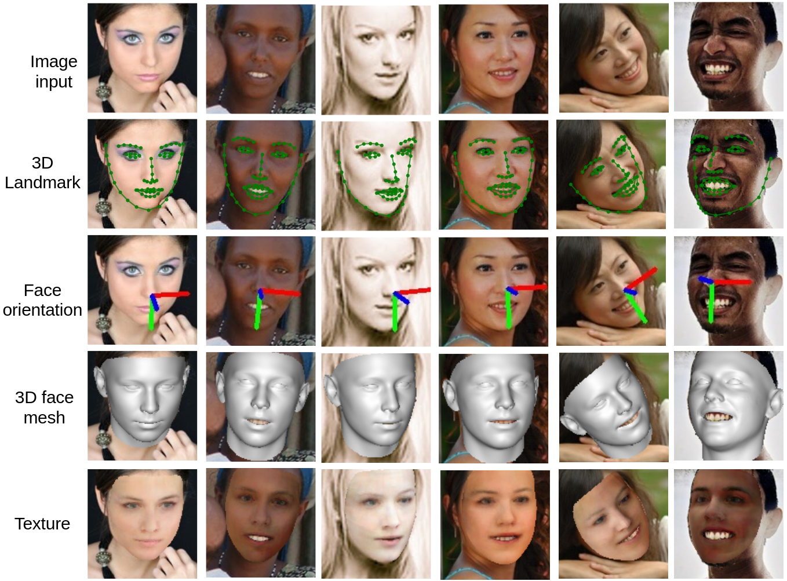
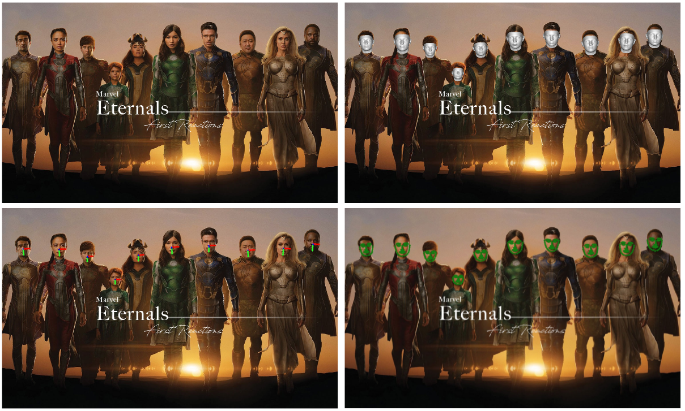
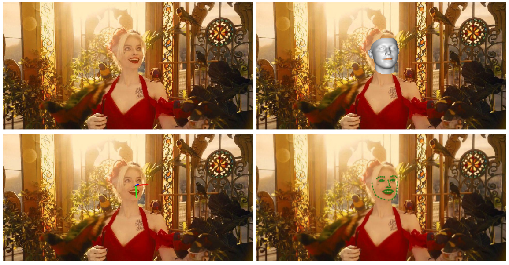
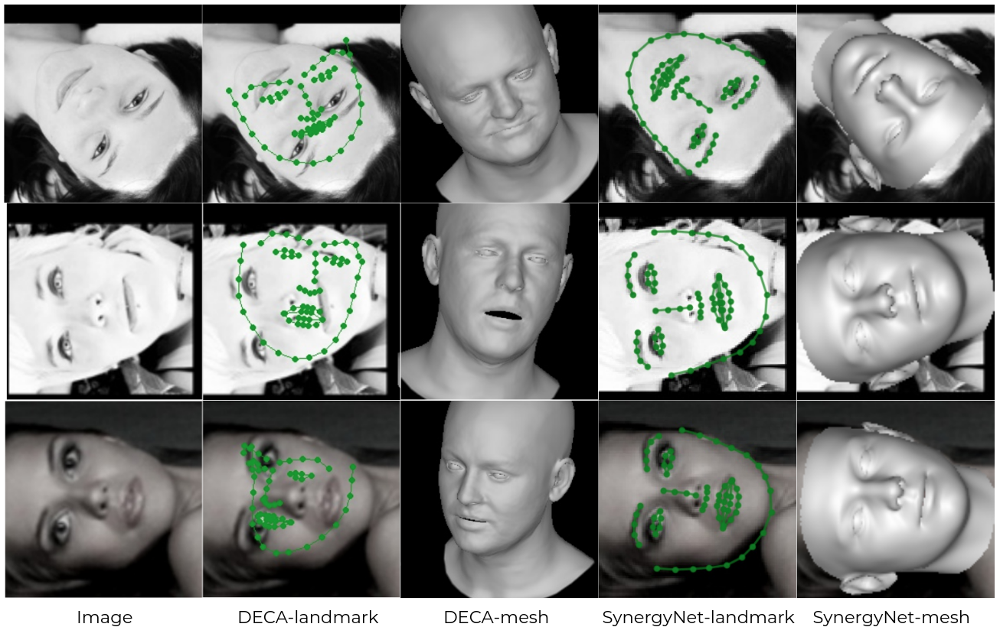
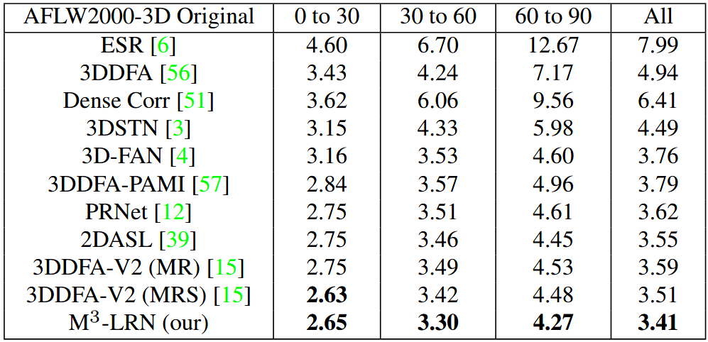
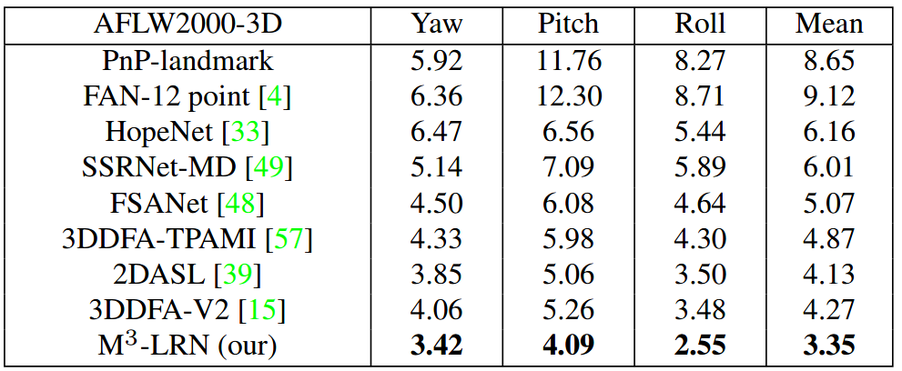
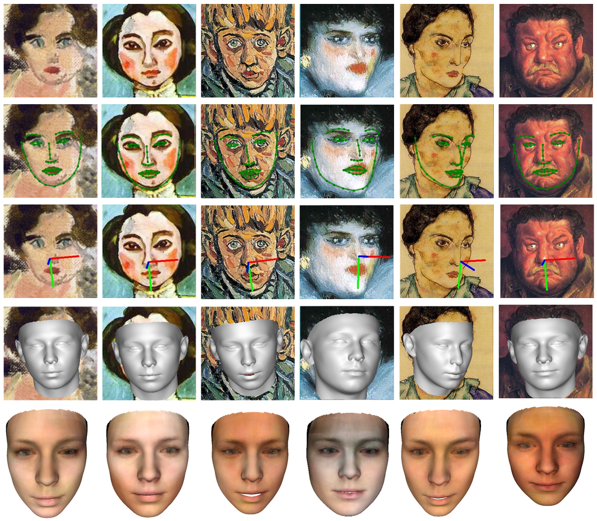
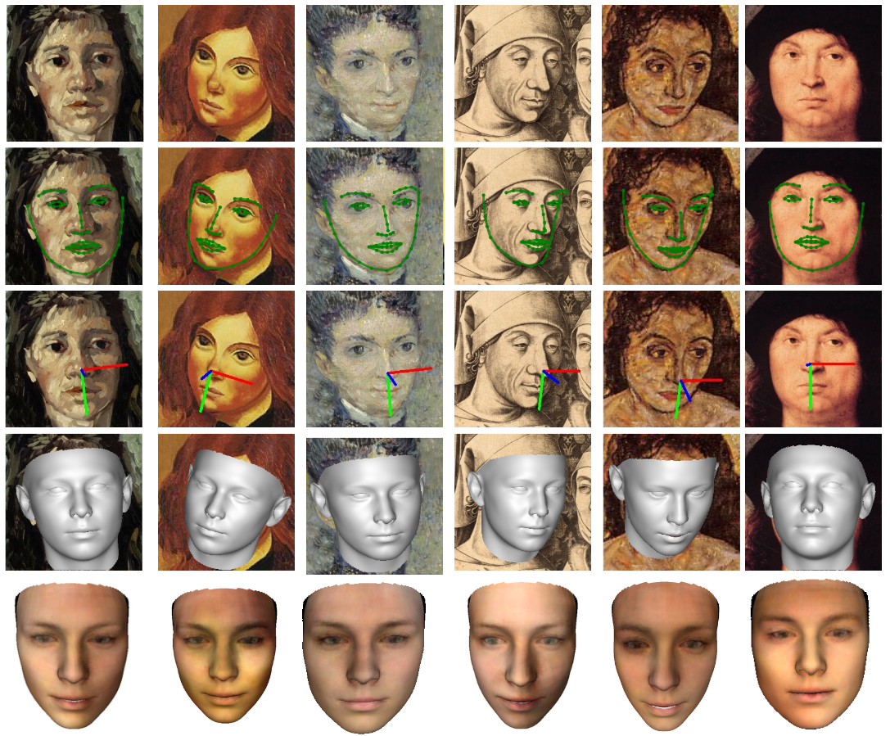

#  <div align="center"> SynergyNet</div>
3DV 2021: Synergy between 3DMM and 3D Landmarks for Accurate 3D Facial Geometry

Cho-Ying Wu, Qiangeng Xu, Ulrich Neumann, CGIT Lab at University of Souther California

[](https://paperswithcode.com/sota/face-alignment-on-aflw?p=synergy-between-3dmm-and-3d-landmarks-for)
[](https://paperswithcode.com/sota/head-pose-estimation-on-aflw2000?p=synergy-between-3dmm-and-3d-landmarks-for)
[](https://paperswithcode.com/sota/face-alignment-on-aflw2000-3d?p=synergy-between-3dmm-and-3d-landmarks-for)

[<a href="https://arxiv.org/abs/2110.09772">paper</a>] [<a href="https://youtu.be/i1Y8U2Z20ko">video</a>] [<a href="https://choyingw.github.io/works/SynergyNet/index.html">project page</a>]

News [Jul 10, 2022]: Add simplified api for getting 3d landmarks, face mesh, and face pose in only one line. See "Simplified API" It's convenient if you simply want to plug in this method in your work.

News: Add Colab demo 
[](https://colab.research.google.com/drive/1q9HRLA3wGxz4IFIseZFK1maOyH0wutYk?usp=sharing)

News: Our new work [<a href="https://github.com/choyingw/Voice2Mesh">Cross-Modal Perceptionist</a>] is accepted to CVPR 2022, which is based on this SynergyNet project.<br>








## <div align="center"> Advantages</div>

:+1: SOTA on all 3D facial alignment, face orientation estimation, and 3D face modeling.<br><br>
:+1: Fast inference with 3000fps on a laptop RTX 2080.<br><br>
:+1: Simple implementation with only widely used operations.<br><br>

(This project is built/tested on Python 3.8 and PyTorch 1.9 on a compatible GPU)

## <div align="center"> Single Image Inference Demo</div>

1. Clone

    ```git clone https://github.com/choyingw/SynergyNet```

    ```cd SynergyNet ```

2. Use conda

    ```conda create --name SynergyNet```

    ```conda activate SynergyNet```

3. Install pre-requisite common packages

    ```PyTorch 1.9 (should also be compatiable with 1.0+ versions), Torchvision, Opencv, Scipy, Matplotlib, Cython ```

4. Download data [<a href="https://drive.google.com/file/d/1YVBRcXmCeO1t5Bepv67KVr_QKcOur3Yy/view?usp=sharing">here</a>] and
[<a href="https://drive.google.com/file/d/1SQsMhvAmpD1O8Hm0yEGom0C0rXtA0qs8/view?usp=sharing">here</a>]. Extract these data under the repo root.

These data are processed from [<a href="https://github.com/cleardusk/3DDFA">3DDFA</a>] and [<a href="https://github.com/shamangary/FSA-Net">FSA-Net</a>].

Download pretrained weights [<a href="https://drive.google.com/file/d/1BVHbiLTfX6iTeJcNbh-jgHjWDoemfrzG/view?usp=sharing">here</a>]. Put the model under 'pretrained/'

5. Compile Sim3DR and FaceBoxes:

    ```cd Sim3DR```

    ```./build_sim3dr.sh```

    ```cd ../FaceBoxes```

    ```./build_cpu_nms.sh```

    ```cd ..```

6. Inference

    ```python singleImage.py -f img```

The default inference requires a compatible GPU to run. If you would like to run on a CPU, please comment the .cuda() and load the pretrained weights into cpu.

## <div align="center"> Simplified API</div>

We provide a simple API for convenient usage if you want to plug in this method into your work.

```python
import cv2
from synergy3DMM import SynergyNet
model = SynergyNet()
I = cv2.imread(<your image path>)
# get landmark [[y, x, z], 68 (points)], mesh [[y, x, z], 53215 (points)], and face pose (Euler angles [yaw, pitch, roll] and translation [y, x, z])
lmk3d, mesh, pose = model.get_all_outputs(I)
```
We provide a simple script in singleImage_simple.py

We also provide a setup.py file. Run <code>pip install -e . </code> You can do <code>from synergy3DMM import SynergyNet</code> in other directory. Note that [<a href="https://drive.google.com/file/d/1SQsMhvAmpD1O8Hm0yEGom0C0rXtA0qs8/view?usp=sharing">3dmm_data</a>] and [<a href="https://drive.google.com/file/d/1BVHbiLTfX6iTeJcNbh-jgHjWDoemfrzG/view?usp=sharing">pretrained weight</a>] (Put the model under 'pretrained/') need to be present.

## <div align="center">Benchmark Evaluation</div>

1. Follow Single Image Inference Demo: Step 1-4

2. Benchmarking

    ```python benchmark.py -w pretrained/best.pth.tar```

Print-out results and visualization fo first-50 examples are stored under 'results/' (see 'demo/' for some pre-generated samples as references) are shown.

Updates: Best head pose estimation [<a href="https://drive.google.com/file/d/1XN74PIMWDue1UNJuDJd16BH8fvZpfwDp/view?usp=sharing">pretrained model</a>]  (Mean MAE: 3.31) that is better than number reported in paper (3.35). Use -w to load different pretrained models.

## <div align="center">Training</div>

1. Follow Single Image Inference Demo: Step 1-4.

2. Download training data from [<a href="https://github.com/cleardusk/3DDFA">3DDFA</a>]: train_aug_120x120.zip and extract the zip file under the root folder (Containing about 680K images).

3. 
    ```bash train_script.sh```

4. Please refer to train_script for hyperparameters, such as learning rate, epochs, or GPU device. The default settings take ~19G on a 3090 GPU and about 6 hours for training. If your GPU is less than this size, please decrease the batch size and learning rate proportionally.

## <div align="center">Textured Artistic Face Meshes</div>

1. Follow Single Image Inference Demo: Step 1-5.

2. Download artistic faces data [<a href="https://drive.google.com/file/d/1yYR5aqSCUGnggjhTbwU4vEwHxV1xq9ko/view?usp=sharing">here</a>], which are from [<a href="https://faculty.idc.ac.il/arik/site/foa/artistic-faces-dataset.asp">AF-Dataset</a>]. Download our predicted UV maps [<a href="https://drive.google.com/file/d/1TWJiitXAfZD_AwoJLw58XBPgOdanqgcG/view?usp=sharing">here</a>] by UV-texture GAN. Extract them under the root folder.

3.
    ```python artistic.py -f art-all --png```(whole folder)
    
    ```python artistic.py -f art-all/122.png```(single image)
    

Note that this artistic face dataset contains many different level/style face abstration. If a testing image is close to real, the result is much better than those of highly abstract samples. 

## <div align="center">Textured Real Face Renderings</div>

1. Follow Single Image Inference Demo: Step 1-5.

2. Download our predicted UV maps and real face images for AFLW2000-3D [<a href="https://drive.google.com/file/d/12QCzkzBCKIEA3DSn6Kx5seeCeoUXKISc/view?usp=sharing">here</a>] by UV-texture GAN. Extract them under the root folder.

3.
    ```python uv_texture_realFaces.py -f texture_data/real --png``` (whole folder)

    ```python uv_texture_realFaces.py -f texture_data/real/image00002_real_A.png``` (single image) 

The results (3D meshes and renderings) are stored under 'inference_output'

## <div align="center">More Results</div>

We show a comparison with [<a href="https://github.com/YadiraF/DECA">DECA</a>] using the top-3 largest roll angle samples in AFLW2000-3D.




Facial alignemnt on AFLW2000-3D (NME of facial landmarks):



Face orientation estimation on AFLW2000-3D (MAE of Euler angles):



Results on artistic faces: 





**Related Project**

[<a href="https://github.com/choyingw/Voice2Mesh">Cross-Modal Perceptionist</a>] (analysis on relation for voice and 3D face)

**Bibtex**

If you find our work useful, please consider to cite our work 

    @INPROCEEDINGS{wu2021synergy,
      author={Wu, Cho-Ying and Xu, Qiangeng and Neumann, Ulrich},
      booktitle={2021 International Conference on 3D Vision (3DV)}, 
      title={Synergy between 3DMM and 3D Landmarks for Accurate 3D Facial Geometry}, 
      year={2021}
      }

**Acknowledgement**

The project is developed on [<a href="https://github.com/cleardusk/3DDFA">3DDFA</a>] and [<a href="https://github.com/shamangary/FSA-Net">FSA-Net</a>]. Thank them for their wonderful work. Thank [<a href="https://github.com/cleardusk/3DDFA_V2">3DDFA-V2</a>] for the face detector and rendering codes.
